# 🚗 Real-Time Road Anomaly Detection using Edge AI on Raspberry Pi

<div align="center">


**An ARM Edge AI competition submission — deploying a custom-trained YOLOv5s model on Raspberry Pi 4 for real-time road anomaly detection with GPS-integrated logging.**

[Features](#-features) • [Architecture](#-system-architecture) • [Setup](#-installation) • [Usage](#-how-to-run) • [Results](#-results--performance-metrics) • [Author](#-author)

</div>

---

## 📌 Project Overview

Road anomalies such as **potholes** and **obstacles** (barriers, debris, fallen objects) are a major cause of vehicle damage and road accidents. This project brings intelligent road safety to the edge by deploying a custom-trained lightweight **YOLOv5s** model on a **Raspberry Pi 4**, enabling real-time anomaly detection without any cloud dependency.

The system is designed for two operational modes:

| Mode | Description |
|------|-------------|
| 🎥 **Offline Video Inference** | Process dashcam footage or pre-recorded videos (`test2.py`) |
| 📷 **Real-Time Camera Inference** | Live detection via USB webcam or Pi Camera (`test.py`) |

Every detected anomaly is automatically logged with a **timestamp**, **bounding box**, **confidence score**, **snapshot image**, and **GPS coordinates** — making it fully suitable for fleet management, road monitoring, and smart city applications.

---

## ✨ Features

- ✅ **Real-time anomaly detection** directly on Raspberry Pi 4
- ✅ **Dual inference modes** — offline video and live camera feed
- ✅ **Pothole & obstacle detection** (barriers, debris, fallen objects)
- ✅ **Automatic snapshot capture** for every detected anomaly
- ✅ **Structured CSV logging** with timestamps and confidence scores
- ✅ **GPS coordinate integration** for geo-tagged anomaly reporting
- ✅ **Lightweight ONNX Runtime inference** — no GPU required
- ✅ **Custom dataset** built and annotated with Roboflow
- ✅ **Optimized edge deployment** pipeline with Non-Maximum Suppression
- ✅ **Robust detection** across varied road conditions and lighting

---

## 🏗️ System Architecture

```mermaid
graph TB
    subgraph Data["📊 Data Layer"]
        A[🌐 Internet Images] --> C[Roboflow Annotation Platform]
        B[🛣️ Real-World Road Images] --> C
        C --> D[Custom YOLO Dataset]
    end

    subgraph Training["🧠 Training Layer - Google Colab"]
        D --> E[YOLOv5s Training - GPU]
        E --> F[best.pt Model]
        F --> G[ONNX Export & Optimization]
        G --> H[best.onnx]
    end

    subgraph Edge["⚡ Edge Deployment - Raspberry Pi 4"]
        H --> I[ONNX Runtime Engine]
        J[📷 USB / Pi Camera] --> K[Frame Capture]
        L[🎥 Dashcam Video] --> K
        K --> M[Frame Preprocessing]
        M --> I
        I --> N[NMS Post-processing]
        N --> O[Bounding Box Rendering]
    end

    subgraph Output["📁 Output Layer"]
        O --> P[🖼️ Snapshot Image]
        O --> Q[📝 CSV Log Entry]
        O --> R[🛰️ GPS Coordinate Tag]
        P & Q & R --> S[outputs/ Directory]
    end

    style Data fill:#1a1a2e,stroke:#0f3460,color:#eee
    style Training fill:#16213e,stroke:#0f3460,color:#eee
    style Edge fill:#0f3460,stroke:#533483,color:#eee
    style Output fill:#533483,stroke:#e94560,color:#eee
```



---

## 🔄 Inference Pipeline Flowchart


---

## 🚀 Deployment Pipeline

```mermaid
graph LR
    A[🖥️ Google Colab<br/>Model Training] -->|best.pt| B[⚙️ ONNX Export<br/>torch.onnx.export]
    B -->|best.onnx| C[📦 Transfer to<br/>Raspberry Pi]
    C --> D[🐍 Python Venv<br/>Setup]
    D --> E[📦 Install Dependencies<br/>onnxruntime · opencv · numpy]
    E --> F[▶️ Run Inference<br/>test.py / test2.py]
    F --> G[📊 Outputs<br/>CSV · Snapshots · GPS]

    style A fill:#34495e,color:#fff
    style B fill:#2980b9,color:#fff
    style C fill:#27ae60,color:#fff
    style D fill:#8e44ad,color:#fff
    style E fill:#e67e22,color:#fff
    style F fill:#c0392b,color:#fff
    style G fill:#16a085,color:#fff
```



---

## 📂 File Structure

```
ARM-PROJECT/
│
├── 📁 model/
│   └── best.onnx                  # Exported ONNX model (YOLOv5s)
│
├── 📁 outputs/
│   ├── anomaly_log.csv            # Auto-generated anomaly log
│   └── 📁 snapshots/             # Captured anomaly frames
│       ├── pothole_20240515_143201.jpg
│       └── obstacle_20240515_143512.jpg
│
├── 📁 videos/
│   └── test.mp4                   # Sample test video for offline inference
│
├── 📁 venv/                       # Python virtual environment
│
├── 📁 docs/                       # Documentation assets (to be added)
│   ├── dataset.png                # Roboflow annotation screenshot
│   └──  output.png                 # Sample detection output
│   
│
├── training_report.pdf        # Google Colab training documentation
├── test.py                        # 🎥 Real-time webcam inference script
├── test2.py                       # 📼 Offline video inference script
├── README.md                      # This file
└── requirements.txt               # Python dependencies
```

---

## 📊 Dataset Creation

The dataset was created from scratch using a combination of internet-sourced road images and real-world photographs.

### Annotation Platform: Roboflow

- **Tool:** [Roboflow](https://roboflow.com) — bounding box annotation
- **Classes:** `pothole`, `obstacle`
- **Augmentations applied:** flip, rotation, brightness adjustment, mosaic
- **Export format:** YOLOv5 PyTorch format


> *Screenshot of Roboflow annotation interface showing labeled pothole and obstacle classes*

[Downlaod Dataset](https://universe.roboflow.com/testing-f6dvv/road_anomalies-3f2b3/browse?queryText=&pageSize=50&startingIndex=0&browseQuery=true)


### Dataset Summary

| Property | Value |
|----------|-------|
| Total Images | ~1000+ annotated frames |
| Classes | `pothole`, `obstacle` |
| Annotation Tool | Roboflow |
| Export Format | YOLOv5 PyTorch |
| Train / Val Split | 80% / 20% |
| Augmentation | Flip, Rotation |

---
<p align="center">
  
</p>

> *Dataset*

## 🧠 Model Training

Training was performed on **Google Colab** using a free GPU runtime for fast iteration.

### Training Configuration

| Parameter | Value |
|-----------|-------|
| Base Model | YOLOv5s (Small) |
| Training Platform | Google Colab (GPU) |
| Epochs | 100 |
| Image Size | 640 × 640 |
| Batch Size | 16 |
| Optimizer | SGD |
| Learning Rate | 0.01 |

### Training Metrics

| Metric | Value |
|--------|-------|
| 🎯 Precision | ~0.88 |
| 🔁 Recall | ~0.75 |
| 📈 mAP@50 | ~0.71 |
| 📉 Box Loss | Converged |
| 📉 Object Loss | Converged |

> Training documentation PDF from Google Colab available in `docs/training_report.pdf`

---

## ⚙️ Model Optimization

The trained PyTorch model was exported to **ONNX format** for hardware-agnostic, optimized edge inference.

```bash
# Export from YOLOv5 training environment
python export.py --weights best.pt --include onnx --img 640
```

### Why ONNX Runtime?

| Feature | Benefit |
|---------|---------|
| ✅ No PyTorch on Pi | Eliminates heavy ML framework dependency |
| ✅ ARM Optimized | Efficient inference on ARM Cortex-A72 |
| ✅ Faster Startup | Reduced initialization time |
| ✅ Cross-Platform | Consistent behavior across environments |
| ✅ Quantization Ready | Supports INT8 optimization (future scope) |

---

## 🍓 Deployment on Raspberry Pi

### Hardware Setup

| Component | Specification |
|-----------|--------------|
| Board | Raspberry Pi 4 Model B with heat sink (8GB RAM) |
| Cooling | Heat sink attached (thermal management) |
| Camera | USB Webcam / Raspberry Pi Camera Module |
| Storage | 32GB+ microSD Card |
| OS | Raspberry Pi OS (64-bit) |
| Power | 5V 3A USB-C supply |

<p align="center">
  
  
</p>
> ⚠️ **Note:** A heat sink is strongly recommended for sustained inference workloads to prevent thermal throttling on the Raspberry Pi 4.

---

## 🛠️ Installation

### Prerequisites

- Raspberry Pi 4 with Raspberry Pi OS
- Python 3.8+
- USB Webcam(1080p)
- Internet connection (for initial setup)

### Step 1: Clone the Repository

```bash
git clone https://github.com/jv681/ARM-PROJECT.git
cd ARM-PROJECT
```

### Step 2: Create Virtual Environment

```bash
python3 -m venv venv
source venv/bin/activate
```

### Step 3: Install Dependencies

```bash
pip install --upgrade pip
pip install opencv-python-headless numpy onnxruntime
```

Or using requirements file:

```bash
pip install -r requirements.txt
```

### `requirements.txt`

```
opencv-python-headless>=4.5.0
numpy>=1.21.0
onnxruntime>=1.12.0
```

> For GPS support, additionally install:
> ```bash
> pip install gpsd-py3
> ```

---

## ▶️ How to Run

### 🎥 Video Inference (Offline Mode)

Process a pre-recorded dashcam video:

```bash
# Activate virtual environment
source venv/bin/activate

# Run video inference
python test2.py
```

**Configuration inside `test2.py`:**

```python
VIDEO_PATH = "videos/test.mp4"       # Path to input video
MODEL_PATH = "model/best.onnx"       # ONNX model path
CONF_THRESHOLD = 0.4                 # Confidence threshold
IOU_THRESHOLD = 0.45                 # NMS IoU threshold
OUTPUT_DIR = "outputs/"              # Output directory
```

---

### 📷 Real-Time Camera Inference

Perform live detection using connected camera:

```bash
# Activate virtual environment
source venv/bin/activate

# Run real-time inference
python test.py
```

**Configuration inside `test.py`:**

```python
CAMERA_INDEX = 0                     # 0 = USB cam, 1 = Pi Camera
MODEL_PATH = "model/best.onnx"
CONF_THRESHOLD = 0.4
IOU_THRESHOLD = 0.45
OUTPUT_DIR = "outputs/"
```

**Controls during runtime:**

| Key | Action |
|-----|--------|
| `q` | Quit inference |
| `s` | Save current frame manually |

---

## 🖼️ Output Examples

### Detection Output

## Output

<p align="center">
  
  
</p>

<p align="center">
  
  
</p>

> *Sample detection showing pothole bounding box with confidence score overlay*

<p align="center">
  
</p>

> *Log file with timestamp, gps(lat and long), prediction score*

### Annotated Frame Example

```
┌─────────────────────────────────────┐
│                                     │
│   ┌──────────┐                      │
│   │ pothole  │  conf: 0.87          │
│   └──────────┘                      │
│                                     │
│        ┌────────────────┐           │
│        │   obstacle     │ conf:0.73 │
│        └────────────────┘           │
└─────────────────────────────────────┘
```

---

## 📝 CSV Logging Format

All detected anomalies are automatically appended to `outputs/anomaly_log.csv`:

```csv
timestamp,class,confidence,x1,y1,x2,y2,snapshot_path,latitude,longitude
2024-05-15 14:32:01,pothole,0.87,142,310,298,420,outputs/snapshots/pothole_143201.jpg,12.9716,77.5946
2024-05-15 14:35:12,obstacle,0.73,400,200,580,350,outputs/snapshots/obstacle_143512.jpg,12.9720,77.5950
```

| Column | Description |
|--------|-------------|
| `timestamp` | Detection date and time |
| `class` | Detected class (`pothole` / `obstacle`) |
| `confidence` | Model confidence score (0.0 – 1.0) |
| `x1, y1, x2, y2` | Bounding box pixel coordinates |
| `snapshot_path` | Relative path to saved snapshot image |
| `latitude` | GPS latitude at detection |
| `longitude` | GPS longitude at detection |

---

## 🛰️ GPS Logging

The system supports real GPS integration using a **USB GPS module** connected to the Raspberry Pi.

### GPS Setup

```bash
# Install GPS daemon
sudo apt-get install gpsd gpsd-clients

# Configure GPS device
sudo gpsd /dev/ttyUSB0 -F /var/run/gpsd.sock

# Install Python GPS library
pip install gpsd-py3
```

### GPS Integration in Code

```python
import gpsd

def get_gps_coordinates():
    try:
        gpsd.connect()
        packet = gpsd.get_current()
        return packet.lat, packet.lon
    except Exception:
        return None, None  # Fallback if GPS unavailable
```

> 📍 If no GPS module is connected, coordinates default to `None` and can be filled in post-processing using video timestamps.

---

## 📈 Results & Performance Metrics

### Model Performance

| Metric | Value |
|--------|-------|
| 🎯 Precision | **~0.88** |
| 🔁 Recall | **~0.75** |
| 📊 mAP@50 | **~0.71** |
| 🧮 Model Size | ~14 MB (ONNX) |
| 🏷️ Classes | pothole, obstacle |

### Edge Deployment Performance

| Metric | Raspberry Pi 4 |
|--------|---------------|
| ⚡ Inference Latency | ~350–500 ms/frame |
| 🎞️ Effective FPS | >5 FPS |
| 🧠 RAM Usage | ~300–400 MB |
| 🌡️ CPU Temp (with heatsink) | ~55–65°C |
| 📦 Runtime | ONNX Runtime (CPU) |
| 🖥️ Deployment OS | Raspberry Pi OS 64-bit |

> 💡 **Note:** FPS can be improved through resolution downscaling, frame skipping, or future quantization (INT8) of the ONNX model.

### Detection Accuracy by Class

| Class | Precision | Recall | mAP@50 |
|-------|-----------|--------|--------|
| pothole | 0.91 | 0.78 | 0.74 |
| obstacle | 0.85 | 0.72 | 0.68 |
| **Overall** | **0.88** | **0.75** | **0.71** |

---

## 🏆 Key Achievements

- 🥇 Successfully deployed a **custom-trained YOLOv5 model** on ARM hardware (Raspberry Pi 4)
- 🏗️ Built a **complete end-to-end pipeline** — from dataset creation to edge deployment
- 📡 Integrated **real GPS coordinate logging** for geo-referenced anomaly mapping
- 🗂️ Implemented **structured CSV logging** for fleet and infrastructure management use cases
- 📸 Automated **snapshot capture** system for evidence-based anomaly reporting
- ⚙️ Achieved **stable real-time inference** under sustained thermal load using heat sink cooling
- 📦 Eliminated cloud dependency with **fully offline on-device inference**
- 🛣️ Demonstrated **robust detection** across varied road conditions, lighting, and camera angles

---

## 🔮 Future Improvements

| Improvement | Description |
|-------------|-------------|
| 🚀 INT8 Quantization | Reduce model size and improve FPS via ONNX INT8 quantization |
| 🔧 TensorRT / TFLite | Explore further optimization with platform-specific runtimes |
| 📱 Mobile App | Build companion app for real-time monitoring dashboard |
| 🗺️ Heatmap Generation | Generate road anomaly heatmaps from GPS-logged data |
| ☁️ Cloud Sync | Optional upload of logs to cloud for fleet-wide monitoring |
| 🎯 Model Improvement | Expand dataset and improve mAP with data augmentation |
| 🔋 Power Optimization | Explore duty-cycle inference for battery-powered deployments |
| 🚗 OBD Integration | Correlate anomaly detection with vehicle speed via OBD-II |

---

## 📚 References

- [YOLOv5 by Ultralytics](https://github.com/ultralytics/yolov5)
- [ONNX Runtime Documentation](https://onnxruntime.ai/docs/)
- [Roboflow — Dataset Annotation Platform](https://roboflow.com)
- [OpenCV Python Documentation](https://docs.opencv.org/4.x/d6/d00/tutorial_py_root.html)
- [Raspberry Pi Official Documentation](https://www.raspberrypi.com/documentation/)
- [gpsd Python Library](https://pypi.org/project/gpsd-py3/)
- [ARM Developer — Edge AI Resources](https://developer.arm.com/solutions/machine-learning-on-arm)

---

## 👤 Author

<div align="center">

**DhinekkaB**

[](https://github.com/jv681)

*ARM Edge AI Competition Submission*

*Real-Time Road Anomaly Detection using Edge AI on Raspberry Pi*

</div>

---

## 📄 License

```
MIT License

Copyright (c) 2024 DhinekkaB

Permission is hereby granted, free of charge, to any person obtaining a copy
of this software and associated documentation files (the "Software"), to deal
in the Software without restriction, including without limitation the rights
to use, copy, modify, merge, publish, distribute, sublicense, and/or sell
copies of the Software, and to permit persons to whom the Software is
furnished to do so, subject to the following conditions:

The above copyright notice and this permission notice shall be included in all
copies or substantial portions of the Software.

THE SOFTWARE IS PROVIDED "AS IS", WITHOUT WARRANTY OF ANY KIND, EXPRESS OR
IMPLIED, INCLUDING BUT NOT LIMITED TO THE WARRANTIES OF MERCHANTABILITY,
FITNESS FOR A PARTICULAR PURPOSE AND NONINFRINGEMENT.
```

---

<div align="center">

⭐ **Star this repo if you found it useful!** ⭐

*Built with ❤️ for safer roads using Edge AI*


</div>
